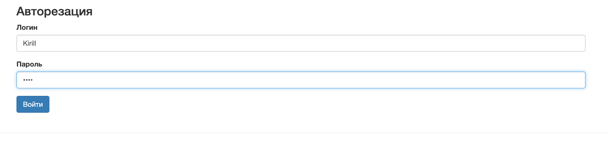
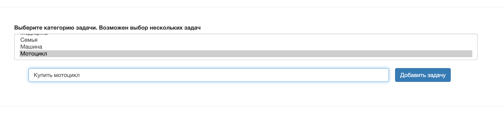
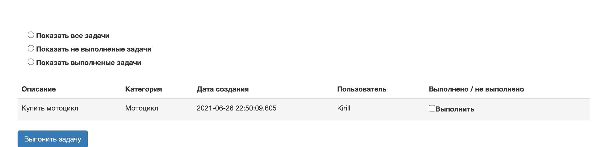

## Проект курса [job4j](http://job4j.ru)

### Список задач

Технологии:
- PostgresSQL
- Hibernate
- Apache Tomcat
- JS / Jquery
- Ajax
- Log4j
- Singleton (On Demand Holder Idom)

Приложение состоит только из главной страницы

Регистрация/авторизация пользователя

Выбор категории и описание задачи

Отображение задач

Если задача выполнена, необходимо отметить ее

Можно посмотреть какие задачи выполнены, а какие нет

